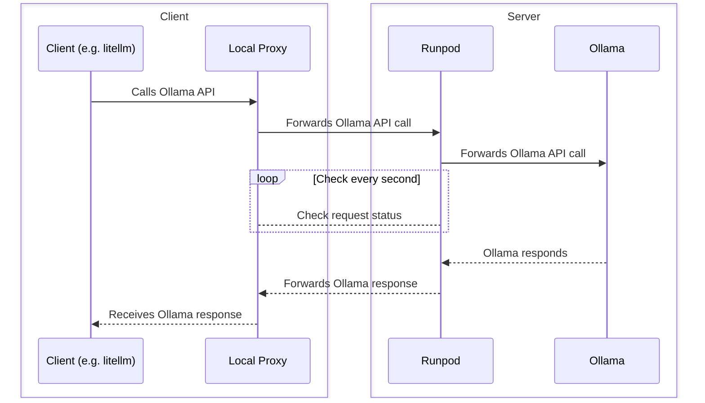

# Running Ollama with Runpod Serverless

## How to use it

1. Clone the repo
2. Run `poetry install --all-extras`
3. You can interact with app through the cli: `runpod-ollama`
4. Create a `.env` file and add your Runpod's API_KEY there `RUNPOD_API_TOKEN=...`

### Commands

#### 1. Create a template and endpoint

To create a template and endpoint for the `phi` model with 10GBs of disk size:

```bash
runpod-ollama create-model phi 10
```

You can check the options with:

```bash
runpod-ollama create-model --help
```

Once the endpoint is created, you need to

1. Go to the endpoint URL and manually change the GPU type, by editing the endpoint.
2. Run the local-proxy server to forward the request to runpod.

Alternatively, you can create the `template` and `endpoint` separately with the CLI or with the Runpod's website (check the Blog).

### 2. Run the local-proxy server

Once the endpoint is created you can run `runpod-ollama start-proxy`:

```bash
❯ runpod-ollama start-proxy
[?] Select an endpoint::
   orca-2 -fb
   llava -fb
   mixtral:8x7b-instruct-v0.1-q5_K_S -fb
 > phi-fb
   mistral-fb
```

This will start the local proxy, and outputs an example to use the endpoint:

```python
import litellm

response = litellm.completion(
    "ollama/phi-fb",
    messages=[
        {"content": "why the sky is blue?"},
    ],
    base_url="http://127.0.0.1:5001/dtaybcvyltprsx",
    stream=False,
)

print(response.choices[0].message["content"])
```

## How it works



### 1. Ollama

You can communicate with Ollama through the rest API. The API is documented [here](https://github.com/ollama/ollama/blob/main/docs/api.md)

```

curl http://localhost:11434/api/generate -d '{
"model": "llama2",
"prompt": "Why is the sky blue?",
"stream": false
}'

```

Responds:

```json
{
  "model": "llama2",
  "created_at": "2023-08-04T19:22:45.499127Z",
  "response": "The sky is blue because it is the color of the sky.",
  "done": true,
  "context": [1, 2, 3],
  "total_duration": 5043500667,
  "load_duration": 5025959,
  "prompt_eval_count": 26,
  "prompt_eval_duration": 325953000,
  "eval_count": 290,
  "eval_duration": 4709213000
}
```

### 2. Runpod

With Runpod's serverless, you can create an endpoint that calls a method you defined. To do that you need:

1. Create a template: The Runpod's template needs a Dockerfile.
   1. The Docker container is executed once the endpoint is created.
   2. In the Docker container, you can call setup a method which is called when your endpoint is called.
2. Create an endpoint: Once the template is created, you can define an endpoint. You should select a template and your GPU type here.

In this project, on the server we:

1. Run Ollama server.
2. Define the endpoint (`runpod_wrapper`) to forward the request directly to the Ollama server.

### 3. Local Proxy

You can call your Runpod endpoint with the following URL formats:

- Run the handler: `https://api.runpod.ai/v2/<pod-id>/run` -> Return job-id
- Check a request status: `https://api.runpod.ai/v2/<pod-id>/status/:id`

To make the client agnostic to the Runpod API, `runpod-ollama start-proxy` runs a local proxy server that forwards the request to runpod,
and waits until they are resolved.

### 4. Client

With the Local Proxy running, you can call the change the Ollama base-url to the local-proxy server, and interact with the Ollama on the server.

## Blog

Check the blog [here](https://medium.com/@pooya.haratian/running-ollama-with-runpod-serverless-and-langchain-6657763f400d)

# Examples

To run the examples, first install the examples dependencies:

```
$ poetry install --all-extras
```

# Limitations

- Currently stream option is not enabled
- Error messages are not readable. In case you encountered error, make sure:
  - The local proxy is running
  - The model name you provided is right
- The docker image should be updated. Some models are not working with this version of the Ollama.
